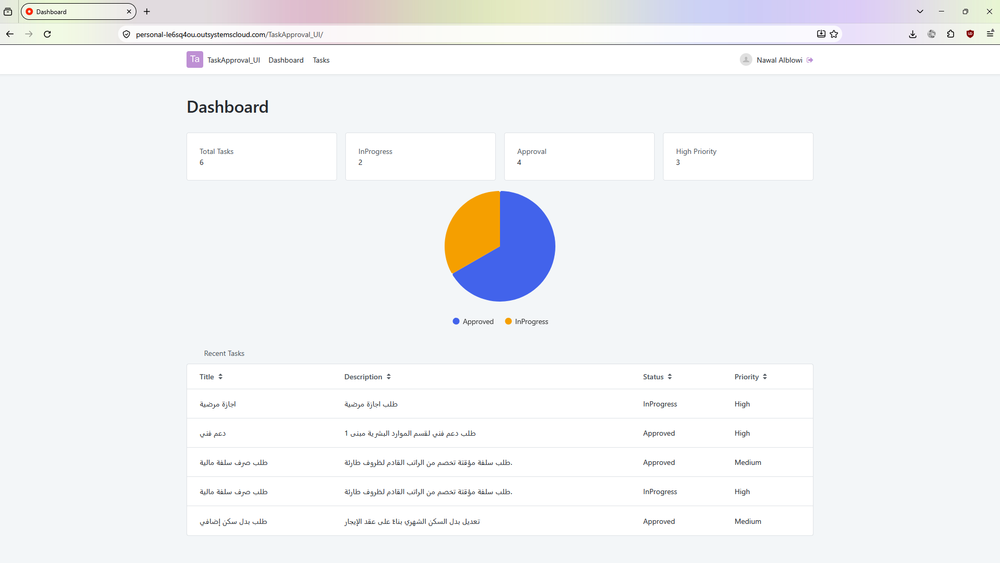
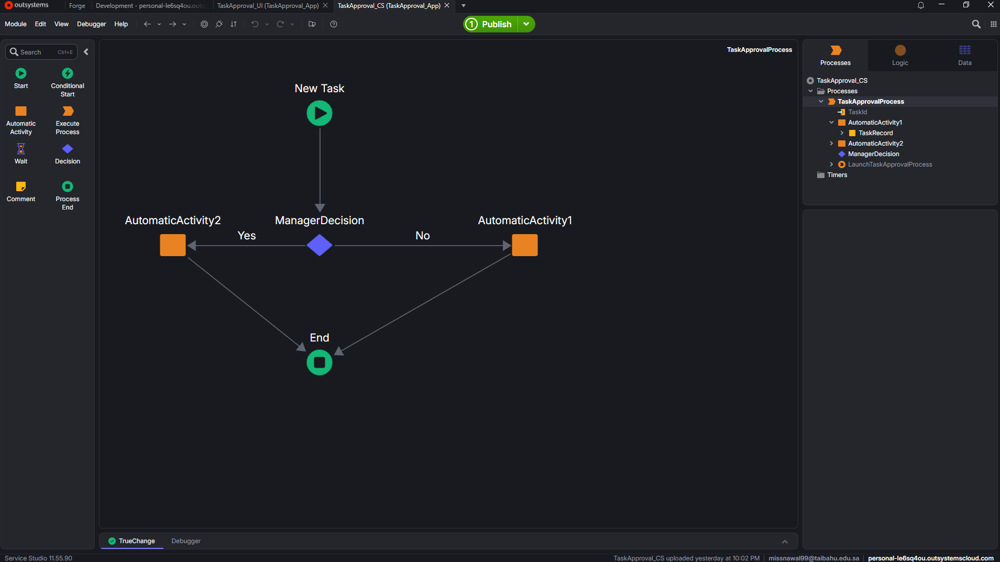
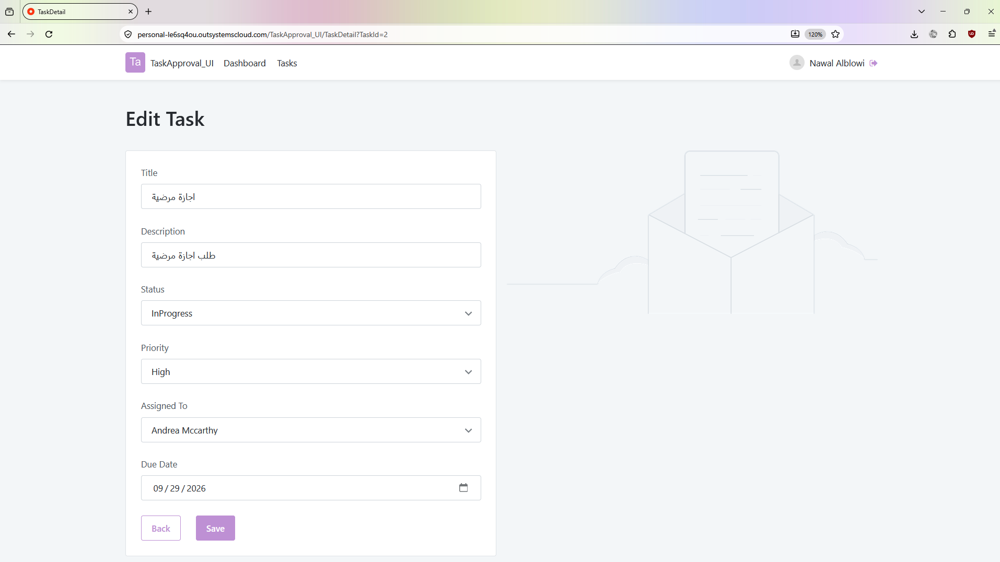
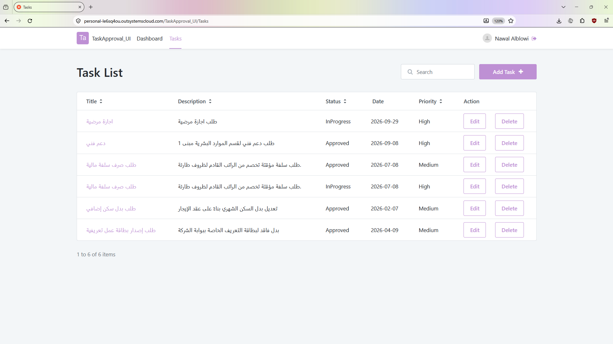

# Task Approval and Management System (TaskApproval_UI)

An intuitive and responsive web application built using **OutSystems** designed to streamline task creation, tracking, and approval workflows within an organization.

## 🚀 Features
- **Dashboard & Analytics:** Real-time overview of tasks with status distribution charts (Approved, In Progress, High Priority).
- **Task Management:** View, create, and track administrative requests such as medical leaves, technical support, and financial loans.
- **Priority & Status Tracking:** Categorize tasks by priority levels (High, Medium) and monitor progress states.

## 💻 Built With
- **Platform:** OutSystems
- **UI/UX:** OutSystems UI Framework

## 📸 Screenshots

### Dashboard Overview

### Process Workflow

### Task Attributes

### Task List

